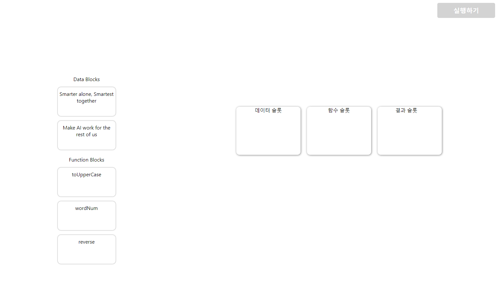

## 결과물 미리보기

## 요구사항 체크
**동작**

- [x] 조합하고자 하는 **데이터 블록**과 **함수 블록**을 빈 슬롯으로 drag&drop 할 수 있습니다.
- [x]  데이터 블록은 **데이터 슬롯**으로만, 함수 블록은 **함수 슬롯**으로만 drag&drop 할 수 있습니다.
- [x]  **실행하기** 버튼을 누르면 데이터에 주어진 함수를 적용해 나온 값이 결과 슬롯에 출력됩니다.
- [ ]  각 슬롯에서는 우측 상단 **X 버튼**을 눌렀을 때, 해당 블록을 제거할 수 있습니다.

**스타일**

- [ ]  빈 슬롯에 블록을 채워넣을 때는 기존 슬롯의 **테두리, 색상과 스타일**이 달라져야 합니다.
- [ ]  **실행하기** 버튼은 모든 슬롯이 채워졌을 때만 활성화됩니다.
- [x]  **X 버튼**은 슬롯이 비어 있을 때는 나타나지 않습니다.

## 해결 방법

- 드래그&드롭 기능을 위한 리액트 라이브러리인 React DnD를 사용하였습니다.
- React Hook인 `useDrag`의 `type`과 `useDrop`의 `accept`를 사용하여 데이터 블록은 **데이터 슬롯**으로만, 함수 블록은 **함수 슬롯**으로만 이동 가능하게 하였습니다
- **실행하기** 버튼을 누르면, onClick을 이용하여 호출된 함수 슬롯에 있는 함수가 데이터 슬롯에 있는 데이터를 가지고 연산을 수행 후, 결과 슬롯에 반영합니다
- 각 아이템을 딕셔너리를 사용하여 생성하였습니다
- 자세한 설명은 주석으로 달려있습니다
